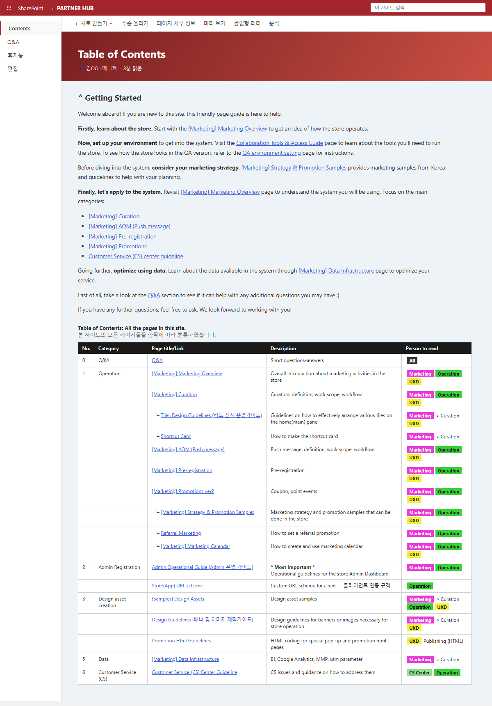
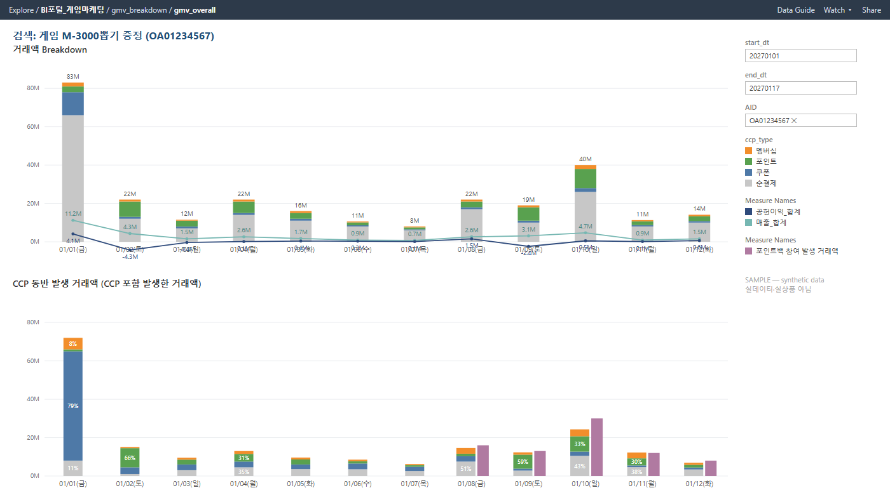

# 📊 analytics-portfolio

> **비즈니스를 먼저 경험한 데이터 분석가의 포트폴리오 저장소**
> 이커머스 앱마켓에서 마케팅 운영을 하며 필요해서 시작한 분석이, 지금은 본업이 되었습니다.
>
> *I believe good analytics starts with understanding the business problem — before writing SQL.*

---

## 👋 소개

이커머스 앱마켓(MAU 천만 규모)에서 **15년간** 마케팅 운영과 데이터 분석을 해온 Business Analyst입니다.

**Core Strengths**

- **Experiment Design** — A/B 테스트 설계·검증 (인센티브 구조 실험으로 CAC 약 30% 절감)
- **Product & Marketing Analytics** — 세그멘테이션 · 코호트 · 리텐션 · 프로모션 ROI
- **Dashboard Development** — 셀프서브 Tableau BI 구축·운영
- **Data Governance** — 테이블 사전 · 표준 지표 쿼리 · SQL Dictionary
- **Workflow Automation** — 반복 산출물 생성 4시간 → 10분 (Python + AI)

📁 **선별 포트폴리오**: [tinyurl.com/kyungmin-ba](https://tinyurl.com/kyungmin-ba)
💼 **LinkedIn**: [linkedin.com/in/kkyungmin1](https://linkedin.com/in/kkyungmin1)

---

## 🖼 Featured Projects

실물 산출물을 가명 데이터로 재현한 샘플입니다. 각 README에 배경 → 설계 → 결과 서사가 정리되어 있습니다.

| 프로젝트 | 내용 |
|---|---|
| 🌐 [Partner Onboarding Knowledge Hub](onboarding_playbook/README.md) | 해외 파트너 Self-service Onboarding 시스템 — 35+ 페이지 Knowledge Hub + 34장 마케팅 플레이북, 1.5년 운영 |
| 📖 [SQL Dictionary](sql_dictionary/README.md) | "같은 지표, 다른 숫자" 문제를 해결한 쿼리 표준화 위키 — 기준정의·[CTE] 모듈·테이블/코드 사전·ERD |
| 📈 [Tableau Dashboards](dashboards/README.md) | GMV Breakdown(리워드별 분해 + 공헌이익 라인) · 주차별 게임 포지셔닝 · 이벤트 퍼널(발급→사용→거래→ROAS) |
| 🏆 [신작 랭킹 알고리즘](ranking_algorithm/README.md) | 2019년 설계한 시간감쇠 랭킹 — **현재까지 실서비스 운영 중** (실화면 포함) |

➕ **[Complete Project List](PROJECTS.md)** — 30+ projects (실험 설계·세그멘테이션·랭킹·자동화, 증빙 링크 포함)
🎪 **[Conference Notes](conferences/)** — 컨퍼런스 참관기 8건 (2024.07~2026.06)
🧪 **case_studies/** — 실무 재구현 케이스 스터디 (작성 중) · 🍳 분석 레시피 노트북(analytics-cookbook)은 별도 저장소로 준비 중

---

## 🌱 성장 서사

| 시기 | 도구 | 단계 |
|---|---|---|
| ~2019 | Excel | 운영 데이터를 피벗·수식으로 직접 검증하던 시기 |
| 2020~ | Python (pandas) | 프로모션 사후분석·ROI 산출을 코드로 전환, 반복 업무 자동화 시작 |
| 2025~ | SQL · Tableau · AI | 원천 데이터 직접 추출 → 분석 → 대시보드 → AI 리포트 풀 파이프라인 |

---

## 🔁 일하는 방식

이 저장소의 프로젝트들은 하나의 사고방식에서 나왔습니다 — **반복을 발견하면 시스템으로 바꿉니다.**

- 반복 문의 → **Knowledge Hub** (파트너 온보딩)
- 반복 쿼리 → **SQL Dictionary** (지표 표준화)
- 반복 분석 → **Tableau 대시보드** (셀프서브 BI)
- 반복 업무 → **Python 자동화** (4시간 → 10분)

> *I don't just solve problems — I design systems that prevent the same problem from happening again.*

분석도 같은 순서입니다 — **질문을 먼저 쓰고, 데이터는 그다음.**

---

## 🔒 원칙

1. **모든 데이터는 합성·가명 데이터입니다.** 실제 회사 데이터·코드·내부 기준값은 일절 포함하지 않으며, 모든 케이스는 공개 가능한 형태로 재구현했습니다.
2. **레시피 형식**: `언제 쓰나 → 재료(데이터 형태) → 코드 → 주의할 점`. "언제 쓰나"는 전부 실무에서 직접 겪은 상황입니다.
3. **검증 규율**: 모든 노트북은 첫 셀에 "확인해야 할 질문"을 먼저 쓰고 시작하며, Sanity Check 셀을 상설로 둡니다.

---

*이 저장소는 계속 업데이트됩니다. (Last updated: 2026.07)*
