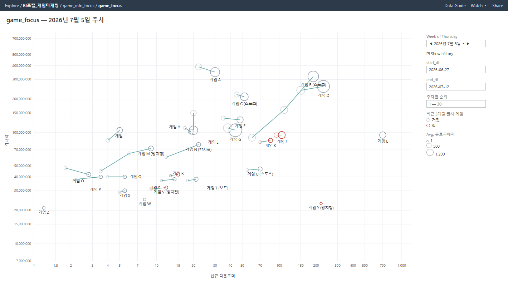
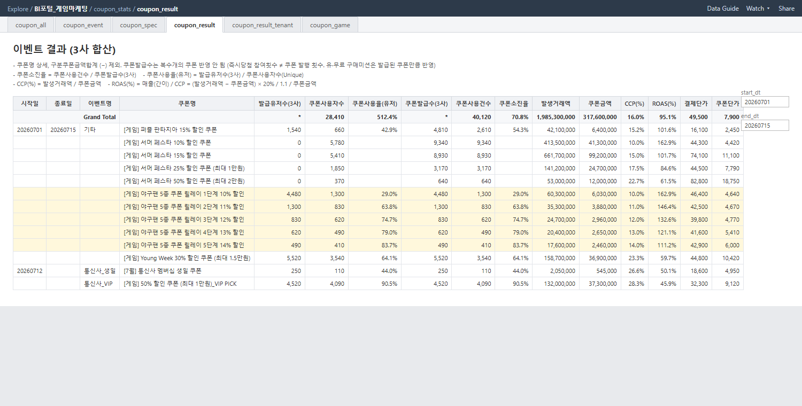

# 📊 Tableau Dashboards — 셀프서브 BI 재현 샘플

> ⚠️ 아래 이미지는 재직 중 직접 설계·운영한 실물 산출물을 **가명 데이터로 재현한 샘플**입니다.
> 게임명·테이블명·코드값·수치는 모두 가공된 것이며, 실데이터가 아닙니다. 구조·산식·운영 방식은 실물과 동일합니다.

## 1. GMV Breakdown 대시보드 (Tableau)

프로모션 상품(AID) 단위로 거래액을 리워드 유형별로 분해하는 일간 모니터링 뷰.

- **상단**: 일자별 거래액을 순결제·쿠폰·포인트·멤버십으로 스택, 매출·공헌이익 추정 라인 오버레이 → 프로모션이 "매출을 만든 건지, 마진을 태운 건지"를 하루 단위로 판별
- **하단**: CCP(쿠폰·캐시·포인트) 동반 발생 거래액을 리워드별 비중으로 분해하고, 포인트백 진행일에는 참여 발생 거래액(보라)을 병렬 표시 → 리워드 투입 대비 동반 매출 확인

## 2. Game Tracking — 주차별 게임 포지셔닝 (Tableau Pages)

X=신규 다운로더, Y=거래액(로그-로그) 산점도에 Tableau Pages 히스토리 트레일을 적용해 **주차별로 게임이 어디서 어디로 이동했는지** 추적. 크기=평균 유료구매자, 빨간 테두리=최근 3개월 신작. 신작의 초기 궤적과 기존작의 이탈 신호를 한 화면에서 감지.

## 3. 이벤트 퍼널 대시보드 (Tableau)

쿠폰 이벤트를 **발급유저 → 사용자 → 사용율 → 소진율 → 발생거래액 → CCP% → ROAS% → 결제/쿠폰단가** 퍼널로 표준화한 결과표. 헤더에 산식 정의를 문서화해 이해관계자 간 지표 해석 차이를 제거. 릴레이형 쿠폰(1~5단계)의 단계별 잔존율로 설계 효율을 검증.

---

**관련 산출물** (별도 프로젝트로 분리)
- 📖 [SQL Dictionary — 분석 쿼리 표준화 위키](../sql_dictionary/README.md)
- 🏆 [시간감쇠 기반 신작 랭킹 알고리즘 — 프로덕션 운영 중](../ranking_algorithm/README.md)
