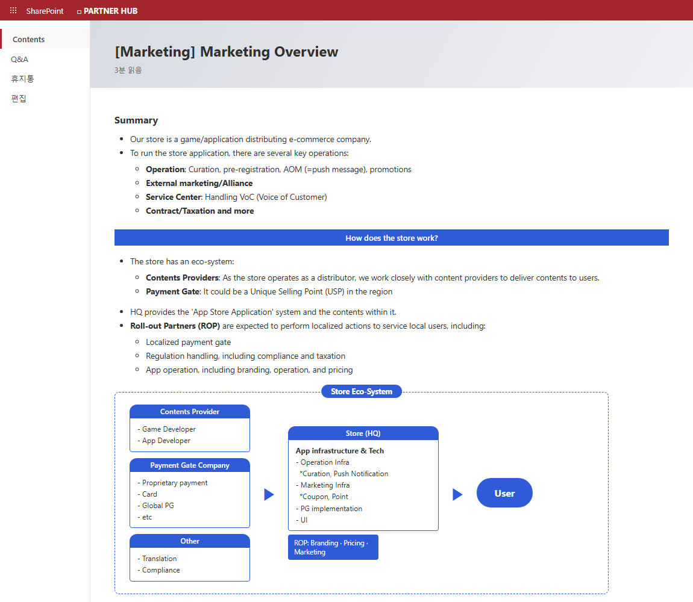
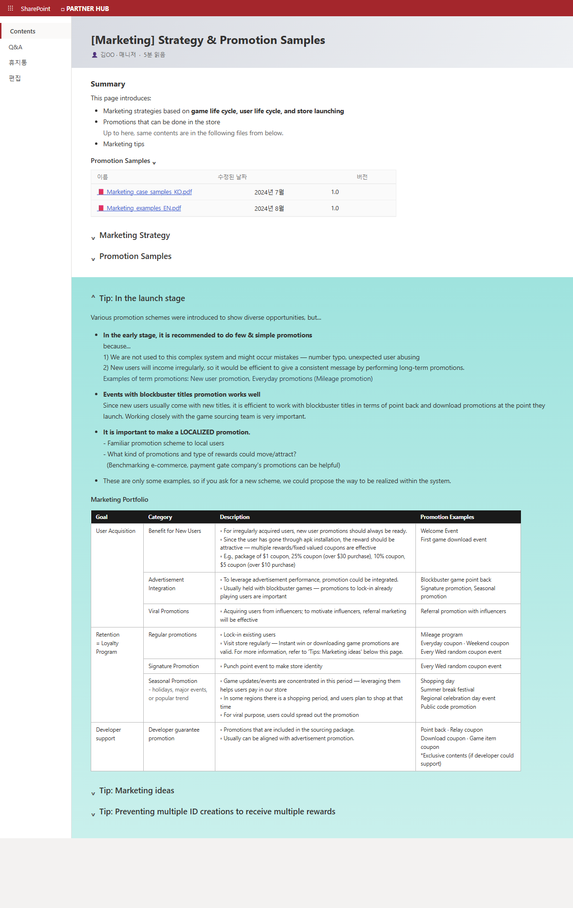
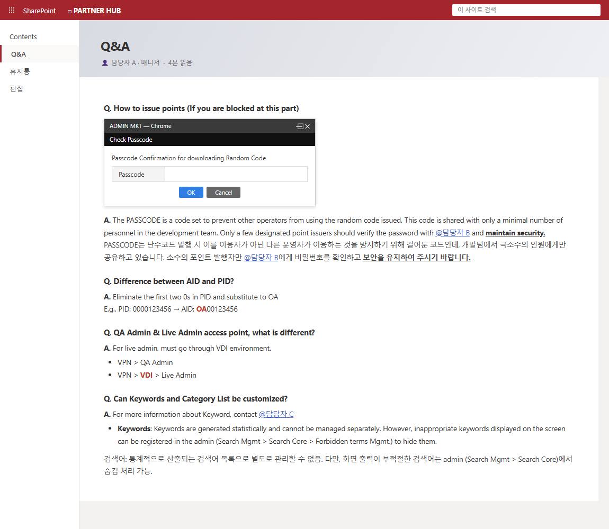

# 🌐 Global Partner Onboarding Playbook

> ⚠️ 재직 중 단독 문서화한 해외 파트너용 온보딩 사이트(영문 20여 페이지, SharePoint)를 **가명·합성 콘텐츠로 재현한 샘플**입니다.
> 회사명·게임명·실명·도메인·내부 시스템명은 모두 가공되었으며, 정보 구조와 문서 설계 방식은 실물과 동일합니다.

**배경**: 해외 롤아웃 파트너가 스토어 운영을 셀프서비스로 학습할 수 있도록 만든 지식체계. 반복 문의를 문서로 전환했고, 담당 이관 후에도 후속 조직이 승계 운영 중.

**설계 포인트 — 여정 + 참조의 2중 내비게이션**
- **여정(Journey)**: "Getting Started"가 신규 파트너의 학습 순서를 서사로 안내 — 스토어 이해 → 환경 세팅 → 마케팅 전략 → 시스템 적용 → 데이터 최적화 → Q&A
- **참조(Reference)**: 같은 페이지들을 카테고리 표로 재분류하고, **Person to read 페르소나 태그**(Marketing/Operation/UXD/CS)로 "내가 읽어야 할 문서"를 역할별 필터링

## Table of Contents — 여정 서사 + 페르소나 태그 목차

## Marketing Overview — 스토어 에코시스템 소개

파트너가 처음 읽는 문서. 스토어 운영의 전체 그림(운영·외부 마케팅·CS·계약)과 Contents Provider → Store → User 에코시스템, 본사/파트너(ROP) 역할 분담을 다이어그램으로 정리.

## Strategy & Promotion Samples — 전략 가이드 + 실전 팁

게임/유저 라이프사이클 기반 마케팅 전략과 한국에서 검증된 프로모션 사례. "Tip: In the launch stage" 등 실전 조언 섹션과, 목표(획득/리텐션/개발사 지원)별 프로모션 포트폴리오 표 제공.

## Q&A — 반복 문의의 셀프서비스 전환

실제로 들어온 질문을 영/한 병기로 축적. 스크린샷과 함께 "어디서 막혔는지" 기준으로 작성해 문의 없이 스스로 해결하도록 유도.

