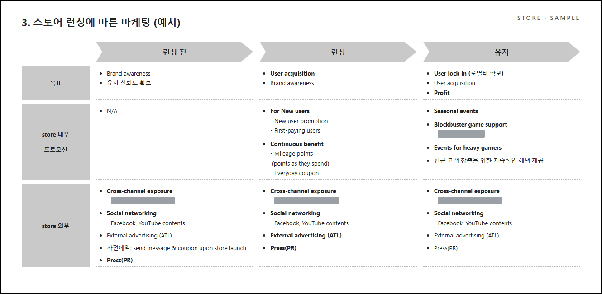
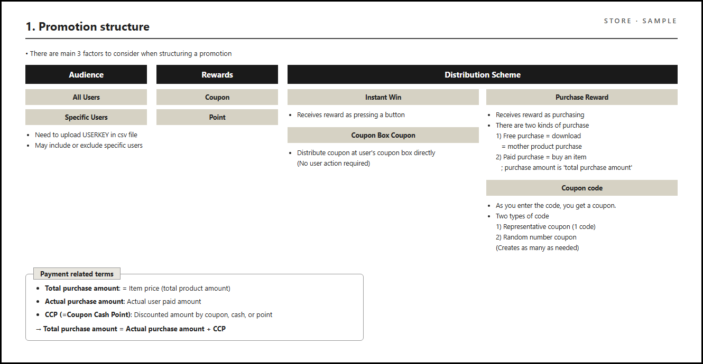
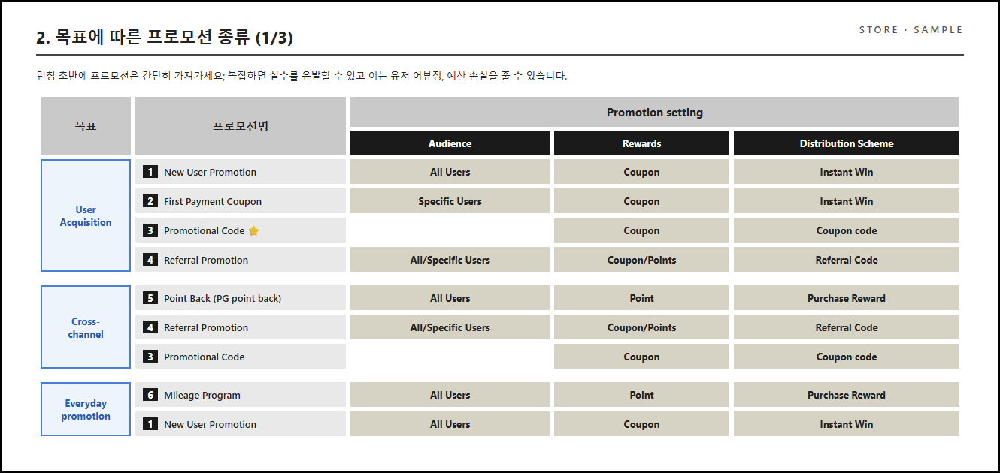
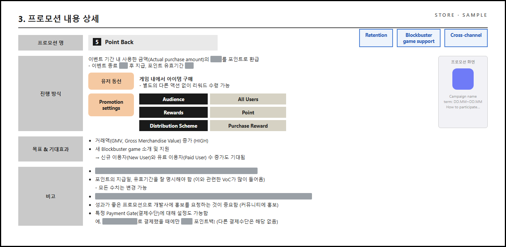
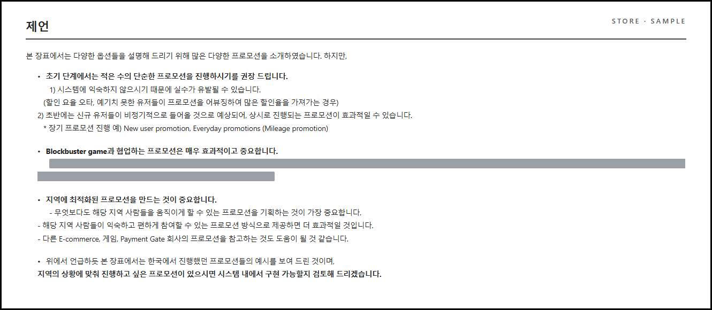

# 🌐 Partner Onboarding Knowledge Hub — App Store Operations

해외 화이트라벨 앱스토어 파트너가 **별도 교육 없이 운영할 수 있도록 Self-service Onboarding 시스템을 설계한 Knowledge Management 프로젝트**입니다.

**Project Highlights**

- 35+ SharePoint pages · 8 knowledge categories
- 34-slide marketing playbook
- 1.5 years of continuous maintenance (Living Documentation)
- English documentation for global partners
- Marketing / Operation / UXD / CS — 4개 직군 동시 온보딩

단순한 문서 정리가 아니라, 신규 담당자가 자신의 역할에 맞는 정보를 스스로 찾아 업무를 수행할 수 있도록 **정보 구조(Information Architecture)와 온보딩 경험(User Journey) 자체를 설계**했습니다. 기존 문서 체계의 문제(지식 분산·반복 문의·특정 담당자 의존)를 발견하고, **정보 구조 설계부터 콘텐츠 기획, 문서 작성, 운영 체계 수립까지 전 과정을 단독으로 수행**했습니다.

> 🔒 **기밀 유지 안내** — 본 저장소의 모든 화면은 파트너사명, 내부 URL, 보안 정보, 예산, 할인율, 사용자 수 등 민감한 정보를 제거하거나 마스킹한 **재현 샘플**입니다. 공개 목적은 운영 데이터가 아니라 **정보 구조와 문서 설계 방식**을 소개하는 것입니다. 원문이 영어인 페이지는 영어를 유지했습니다.

---

## Design Principles

이 프로젝트의 모든 설계 결정은 다섯 가지 원칙에서 나왔습니다.

1. **Learn by journey, not by file structure.** — 파일 목록이 아니라 업무를 배우는 순서대로 안내한다.
2. **Show only role-relevant information.** — 자신의 역할에 필요한 문서만 보이게 한다.
3. **Standardize page layouts to reduce cognitive load.** — 어떤 문서를 열어도 같은 위치에 같은 종류의 정보가 있다.
4. **Convert repeated support work into reusable documentation.** — 두 번 들어온 질문은 문서가 된다.
5. **Treat documentation as a living product, not a static manual.** — 문서는 출시 후에도 버전업하는 제품이다.

---

## 1. 프로젝트 배경

해외 파트너사는 우리 플랫폼 기반으로 자체 앱스토어를 운영해야 했지만, 운영에 필요한 지식은 한국 운영자의 경험, 이메일 답변, 여러 내부 문서, 한국어 Wiki에 분산되어 있었습니다. 파트너사에는 Marketing, Operation, UXD, CS 등 다양한 직군이 있어 "문서를 한곳에 모아두는" 방식으로는 필요한 정보를 찾기 어려웠고, 그 결과 —

- 신규 담당자 교육에 많은 시간이 소요되고
- 동일한 질문이 반복되었으며
- 운영 경험이 특정 담당자에게 의존하는 문제가 발생했습니다.

**목표**: 운영 경험을 개인이 아닌 시스템에 축적하여, 신규 담당자가 영어 문서만으로 필요한 업무를 스스로 찾아 수행하는 **Self-service Onboarding 환경** 구축.

---

## 2. 구축한 것

### A. SharePoint Knowledge Hub (35+ 페이지 · 8개 카테고리)

**① 온보딩 중심 정보 구조** — 파일 목록 대신, 사용자가 실제 업무를 배우는 순서대로 이동하도록 설계 (Principle 1):
*서비스 이해 → 환경 설정 → 운영 전략 → 관리자 시스템 → 데이터 활용 → FAQ*

**② 역할 기반(User Role) 정보 탐색** — 모든 문서에 Marketing / Operation / UXD / CS / All 태그를 부여해, 자신의 역할에 필요한 문서만 필터링해 읽도록 구성 (Principle 2).

**③ 카테고리 설계(Taxonomy)** — Q&A, Marketing Operation, Admin Registration, Design Asset, Data, Customer Service, JIRA, Collaboration Tools & Environment의 8개 분류에 부모-자식 구조를 적용:

- *Promotion → Curation → Tile Design Guideline → Shortcut Card* (마케팅 담당자가 "프로모션"에서 출발해 카드 제작까지 내려가는 경로)
- *Design Asset → Design Guidelines → Promotion Landing / HTML Guidelines* (디자이너가 "제작물"에서 출발해 배너·랜딩·HTML 규격까지 내려가는 경로)

**④ 문서 템플릿 표준화** — 모든 운영 문서를 *정의 → 언제 사용하는가 → 업무 범위 → 업무 절차 → 관련 문서* 구조로 통일 (Principle 3).

**⑤ Living Documentation** — 운영 중 반복되는 질문을 지속적으로 FAQ에 반영하고 Promotions Guide를 v1 → v2로 발전시키는 등, 1년 6개월 이상 운영하며 **지식이 다시 문서로 돌아오는 선순환**을 유지 (Principles 4–5).

#### Table of Contents — 온보딩 여정 + 역할 태그 목차

Getting Started가 학습 순서를 서사로 안내하고(여정), 아래 목차 표가 같은 페이지들을 카테고리·역할 태그로 재분류합니다(참조). 하나의 콘텐츠를 두 가지 경로로 찾게 하는 2중 내비게이션 구조.

#### Marketing Overview — 파트너가 처음 읽는 문서

스토어 운영의 전체 그림(운영·외부 마케팅·CS·계약)과 Contents Provider → Store(HQ) → User 에코시스템, 본사/롤아웃 파트너(ROP)의 역할 분담을 다이어그램으로 정리.

#### Q&A — 반복 문의의 셀프서비스 전환

실제로 들어온 질문을 영/한 병기로 축적. 스크린샷과 함께 "어디서 막혔는지" 기준으로 작성해 문의 없이 스스로 해결하도록 유도. Living Documentation의 핵심 채널.

### B. Marketing Playbook (34 Slides)

한국에서 축적된 프로모션 운영 경험을 해외 파트너가 그대로 활용할 수 있도록 제작한 플레이북. 기능 설명이 아니라 **실제 운영 전략과 의사결정 기준**을 전달하는 것이 목적입니다.

**① 운영 프레임워크** — 게임 라이프사이클 × 고객 라이프사이클 × 앱스토어 런칭 단계, 세 관점에서 "언제 어떤 프로모션을 운영해야 하는지" 정리. 아래는 런칭 단계(런칭 전 → 런칭 → 유지)별로 목표·스토어 내부 프로모션·외부 채널 활동을 매핑한 슬라이드.

**② 프로모션 공통 프레임워크** — 모든 프로모션을 *Audience × Rewards × Distribution Scheme* 3축으로 정의하고, Total Purchase / Actual Purchase / CCP 등 핵심 지표 정의를 표준화 → 파트너와 플랫폼 운영자가 같은 언어로 소통.

3축 프레임워크가 있으면 어떤 프로모션이든 "설정값의 조합"으로 환원됩니다. 목표별 프로모션 종류를 이 조합으로 정리한 슬라이드:

**③ 프로모션 템플릿 표준화** — 12가지 프로모션을 *진행 방식(유저 동선 + 설정값) → 목표·기대효과 → 비고(운영 유의사항)* 동일 형식으로 정리. 아래는 Point Back 예시 — 우측 상단 태그(Retention / Blockbuster game support / Cross-channel)로 목표 분류와 연결됩니다.

**④ 운영 전략 제언** — 런칭 초기에는 단순한 프로모션부터(어뷰징·예산 손실 방지), 대형 게임과의 협업 우선, 국가 특성에 맞는 현지화. 마지막에 "원하는 프로모션이 있으면 시스템 구현 가능성을 검토해 주겠다"는 협업 제안으로 마무리.

#### Strategy & Promotion Samples — 플레이북의 웹 버전

플레이북 핵심 내용을 Knowledge Hub 페이지로도 제공. "Tip: In the launch stage" 등 실전 조언 섹션과 목표(획득/리텐션/개발사 지원)별 Marketing Portfolio 표.

---

## 3. Outcomes

- **Self-service onboarding environment established** — 4개 직군이 하나의 영어 Knowledge Hub로 별도 교육 없이 업무 수행
- **Single source of truth for partner operations** — 1.5년간 지속 개선하며 파트너 운영의 기준 문서 역할
- **Reduced dependency on experienced operators** — 반복 문의를 FAQ·가이드로 전환해 한국 운영자 개인 경험에 대한 의존 제거
- **Knowledge transferred from individuals to organizational assets** — 담당 이관 후에도 후속 조직이 승계 운영

## 4. 이 프로젝트가 보여주는 역량

| 역량 | 내용 |
|---|---|
| Information Architecture | 사용자 역할과 온보딩 여정을 중심으로 정보 구조 설계 |
| Product Thinking | 조직 구조가 아닌 사용자의 업무 흐름에 맞춘 정보 경험 설계 |
| Knowledge Management | 반복 지원 업무를 재사용 가능한 문서로 전환하고 지속 관리 |
| Standardization | 문서·프로모션·KPI 정의를 표준화해 일관된 운영 체계 구축 |
| Cross-functional Communication | Marketing/Operation/UXD/CS가 동일한 기준으로 협업하는 공통 언어 구축 |
