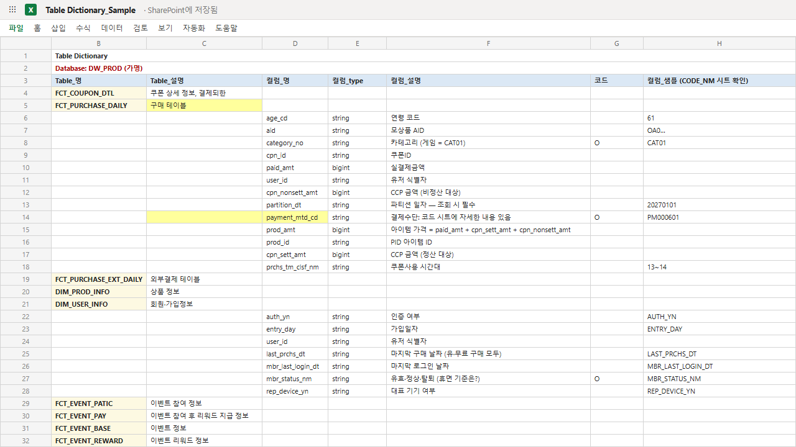
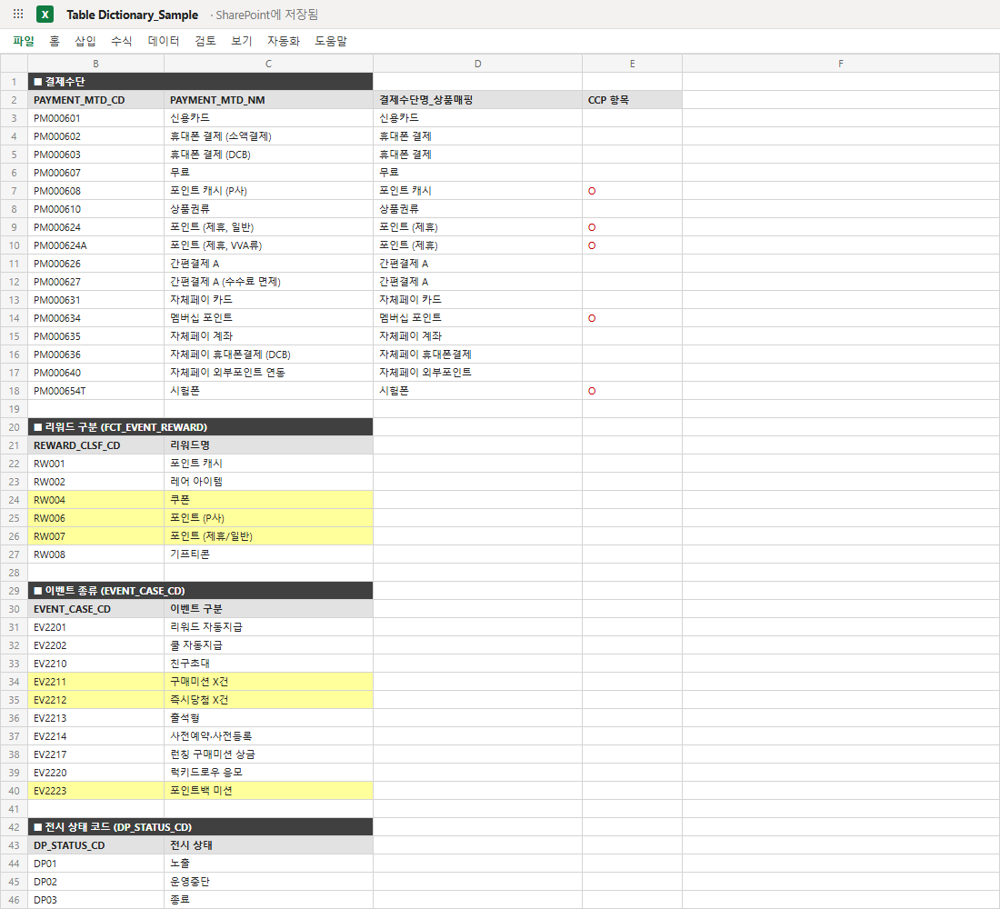

# 📖 SQL Dictionary — 분석 쿼리 표준화 위키

"같은 지표인데 사람마다 숫자가 다른" 문제를 해결하기 위해 직접 설계·구축·운영한 **사내 SQL 표준화 위키(SharePoint)**입니다. 전사 표준 지표의 기준정의부터 재사용 쿼리 모듈, 테이블·코드 사전, ERD까지 — 분석에 필요한 기준을 한 곳에 모아 팀의 **Single Source of Truth**로 운영했습니다.

**Project Highlights**

- 테이블 사전 21개 테이블 · 377개 컬럼 문서화
- 표준 지표 기준정의 + 주석 달린 base 쿼리
- 재사용 가능한 [CTE] 모듈 체계
- 코드값 조견표(CODE_NM) + 도메인별 ERD
- 기준정의 / 집계 / 예제 3단 구분 + 업무영역 태그

> 🔒 **기밀 유지 안내** — 모든 화면은 게임명·테이블명·코드값·URL·수치를 가공한 **재현 샘플**입니다. 공개 목적은 데이터가 아니라 **표준화 체계의 설계 방식**입니다.

---

## 1. 배경

분석 요청이 늘면서 같은 "거래액"을 뽑아도 담당자마다 숫자가 달라지는 일이 반복됐습니다. 원인은 사람이 아니라 구조였습니다 —

- 지표 산식·제외조건이 개인 쿼리 파일 속에만 존재
- 어떤 테이블·컬럼을 써야 하는지에 대한 공식 문서 부재
- 반복 사용하는 서브쿼리(포인트 지급/소진, 이벤트 참여자 등)를 매번 새로 작성

**목표**: 지표의 정의·산출 방법·데이터 출처를 문서로 고정해, 누가 쿼리해도 같은 숫자가 나오는 환경 만들기.

## 2. 구축한 것

### 홈 — Dictionary & News + SQL Sample 목록

모든 문서를 **기준정의 / 집계 / 예제**로 구분하고 업무영역(거래액·쿠폰·게임정보·포인트·회원) 태그를 부여. 재사용 가능한 쿼리 조각은 `[CTE]` 접두어로 모듈화해 관련 문서와 상호 연결했습니다. 신규 문서는 News 카드로 노출해 조회를 유도.

### 기준정의 페이지 — 전사 표준 거래액

산식 + 제외조건 + 검증용 대시보드 링크 + 주석 달린 base 쿼리를 한 페이지에. "본 쿼리는 정의용 base이며 집계는 목적에 맞게 별도 작성하세요" 같은 사용 가이드로 오용을 방지했습니다.

### Table Dictionary — 컬럼 사전 & 코드 조견표

주요 테이블의 컬럼 정의(타입·설명·샘플값)와 코드성 컬럼의 CODE_NM 시트 상호참조. "이 컬럼이 무슨 뜻이고 어떤 값이 오는지"를 쿼리 없이 확인할 수 있게 했습니다.

### ERD — 도메인별 테이블 관계도

포인트 도메인 예시: 테이블 간 조인키를 명시하고, 헷갈리기 쉬운 *지급 예정액 / 지급액 / 사용액*이 각각 어느 테이블·컬럼에서 나오는지 주석으로 구분했습니다.

## 3. Outcomes

- **누가 쿼리해도 같은 숫자** — 표준 산식·제외조건이 문서로 고정되어 지표 해석 논쟁 제거
- **쿼리 작성 시간 단축** — [CTE] 모듈과 base 쿼리 재사용으로 반복 작성 제거
- **온보딩 자산화** — 신규 인력이 테이블 사전·ERD로 데이터 구조를 자습 가능
- [글로벌 파트너 온보딩 Knowledge Hub](../onboarding_playbook/README.md)와 함께, 반복 지원 업무를 문서 시스템으로 전환한 두 번째 사례

## 4. 이 프로젝트가 보여주는 역량

| 역량 | 내용 |
|---|---|
| Data Governance | 지표 정의·데이터 출처·코드값의 표준화 체계 설계 |
| SQL Engineering | 재사용 CTE 모듈화, 정의용 base 쿼리 패턴 |
| Documentation Design | 기준정의/집계/예제 분류 + 업무영역 태그 + 상호참조 구조 |
| Knowledge Management | 개인 쿼리 파일 속 지식을 조직 자산으로 전환 |
